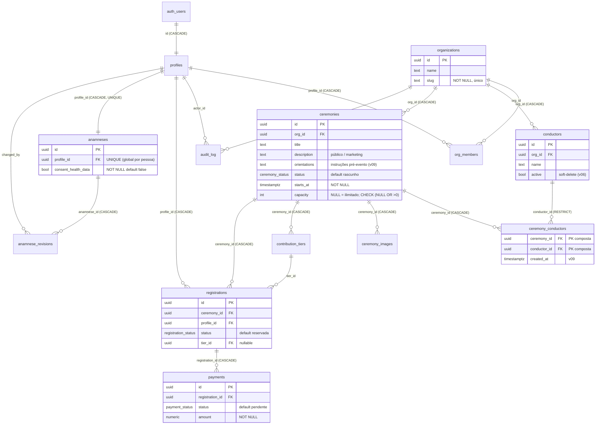

# Arquitetura de banco — Hauxe (pós v05–v09)

Documento consolidado do estado do banco após as migrações v05–v09b.
Fonte: introspecção via MCP (`pg_policies`, `pg_proc`, `pg_trigger`,
`information_schema`) + relatórios das fases. Itens não verificáveis estão
marcados com `[VERIFICAR]`.

Projeto Supabase: `hauxe` (ref `xgjnsyffibdahymaropx`, região sa-east-1).

---

## 1. Tabelas e relacionamentos

13 tabelas em `public`, todas com RLS habilitado. Diagrama com FKs e ação de
`ON DELETE`:

> Decisão LGPD registrada: `anamneses` é **global por pessoa**
> (`UNIQUE(profile_id)`), não por org. Ver `CLAUDE.md`.

### Enums

| Enum | Valores |
|---|---|
| `user_role` | super_admin, org_admin, conductor, participant |
| `ceremony_status` | rascunho, publicada, encerrada, cancelada |
| `registration_status` | pendente, aguardando_pagamento, reservada, confirmada, lista_espera, cancelada, check_in |
| `payment_status` | pendente, pago, expirado, estornado, falhou |
| `payment_method` | pix, manual, outro |

**Status que ocupam vaga** (enforcement v09): `reservada`, `pendente`,
`aguardando_pagamento`, `confirmada`, `check_in`. **Não ocupam:** `cancelada`,
`lista_espera`.

---

## 2. Policies por tabela / bucket

Helpers usados: `is_org_member(org)` (membro da org **ou** super_admin) e
`is_super_admin()`. `(SELECT auth.uid())` é usado nas policies novas (padrão
initplan).

### Tabelas `public`

| Tabela | Leitura (SELECT) | Escrita |
|---|---|---|
| `organizations` | membros (`is_org_member(id)`) | super_admin (ALL) |
| `org_members` | membros da org | — (gerenciado por fluxos privilegiados) |
| `profiles` | próprio (`id=auth.uid()` ou super_admin) + staff de org de inscrito | próprio (UPDATE) |
| `conductors` | `is_org_member(org_id)` | **org_admin** da org ou super_admin (INSERT/UPDATE/DELETE) — v06 |
| `ceremonies` | publicada **OU** `is_org_member(org_id)` | staff da org (`is_org_member`, ALL) |
| `ceremony_conductors` | publicada **OU** membro da org | **org_admin** da org ou super_admin (INSERT/DELETE) — v09 |
| `ceremony_images` | via cerimônia (staff/publicada) | staff da org (ALL) |
| `contribution_tiers` | via cerimônia | staff da org (ALL) |
| `registrations` | dono (`profile_id=auth.uid()`) + staff da org (SELECT/UPDATE) | dono (ALL) |
| `payments` | dono (via registration) + staff da org | — (escrita via Edge Function service_role) |
| `anamneses` | dono (`profile_id=auth.uid()`) + staff da org quando há inscrição | dono (ALL) |
| `anamnese_revisions` | dono (via anamnese) | — (grava via trigger SECURITY DEFINER) |
| `audit_log` | staff da org (`org_id NOT NULL AND is_org_member`) | — |

### Storage (`storage.objects`)

| Bucket | Leitura | Escrita |
|---|---|---|
| `ceremony-images` (público) | **pública** (`bucket_id` apenas) | staff da org via `{ceremony_id}/…`; avatar de condutor via `conductors/{org_id}/…` (v07) — INSERT/UPDATE/DELETE por `is_org_member` |
| `anamnese-files` (privado) | **dono** (`foldername[1]=auth.uid()`) **+ staff** da org do inscrito (v08) | dono (INSERT/DELETE) |

Convenções de path: `ceremony-images/{ceremony_id}/…`,
`ceremony-images/conductors/{org_id}/…`, `anamnese-files/{profile_id}/…`.

---

## 3. Funções e triggers

### Funções (schema `public`)

| Função | Sec | search_path | Propósito / por quê |
|---|---|---|---|
| `is_org_member(uuid)` | DEFINER | public | Helper RLS. DEFINER p/ ler `org_members` independente da RLS do chamador. |
| `is_super_admin()` | DEFINER | public | Helper RLS (lê `profiles.role`). |
| `handle_new_user()` | DEFINER | public | Cria `profiles` no signup (trigger em `auth.users`). DEFINER p/ escrever em `public` a partir de `auth`. |
| `set_updated_at()` | DEFINER | public | `touch` de `updated_at`. |
| `refresh_registration_status(uuid)` | DEFINER | public | Promove/rebaixa `registrations.status` entre `reservada` e `confirmada` conforme ficha+pagamento. |
| `on_payment_change()` | DEFINER | public | Trigger AFTER em `payments` → chama refresh. |
| `on_anamnese_change()` | DEFINER | public | Trigger AFTER em `anamneses` → chama refresh p/ as inscrições da pessoa. |
| `snapshot_anamnese_revision()` | DEFINER | public | Grava histórico em `anamnese_revisions` (AFTER UPDATE). |
| `simulate_payment(uuid,numeric,uuid)` | DEFINER | public | Mock de PIX para testes. |
| `check_ceremony_capacity()` | DEFINER | `''` | Enforcement de vagas (v09). **DEFINER** porque precisa contar **todas** as inscrições da cerimônia, além da RLS do participante (que só vê as próprias). `EXECUTE` revogado de PUBLIC/anon/authenticated (só roda como trigger). |
| `enforce_ceremony_conductor_same_org()` | **INVOKER** | `''` | Junção mesma-org (v09b). **INVOKER** de propósito: a própria RLS oculta condutor de outra org → `SELECT` retorna NULL → `IS DISTINCT` dispara `conductor_org_mismatch`. Sem escalada de privilégio. |
| `rls_auto_enable()` | DEFINER | pg_catalog | Plataforma Supabase (event trigger) — auto-habilita RLS em tabelas novas. |

### Triggers

| Tabela | Trigger | Quando | Função |
|---|---|---|---|
| `auth.users` | `on_auth_user_created` | AFTER | `handle_new_user` |
| `anamneses` | `trg_anamnese_status_sync` | AFTER | `on_anamnese_change` |
| `anamneses` | `trg_anamnese_revision` | AFTER | `snapshot_anamnese_revision` |
| `anamneses` | `trg_anamnese_updated` | BEFORE | `set_updated_at` |
| `payments` | `trg_payment_status_sync` | AFTER | `on_payment_change` |
| `payments` | `trg_payment_updated` | BEFORE | `set_updated_at` |
| `registrations` | `trg_ceremony_capacity` | BEFORE INS/UPD | `check_ceremony_capacity` |
| `registrations` | `trg_registration_updated` | BEFORE | `set_updated_at` |
| `ceremony_conductors` | `trg_ceremony_conductor_same_org` | BEFORE INS/UPD | `enforce_ceremony_conductor_same_org` |
| `ceremonies` / `conductors` / `organizations` / `profiles` | `trg_*_updated` | BEFORE | `set_updated_at` |
| `storage.objects` | `storage.protect_delete` | BEFORE DELETE | **plataforma** — bloqueia DELETE direto salvo GUC `storage.allow_delete_query='true'` (ver §6) |

**Interação capacidade × status assíncrono:** `refresh_registration_status`
só transita `reservada ↔ confirmada` (ambos ocupam vaga). `check_ceremony_capacity`
só valida quando a linha **entra** em ocupação (INSERT, ou não-ocupante →
ocupante). Logo a confirmação automática nunca é bloqueada por capacidade.

---

## 4. Security Advisor — warnings intencionais

Estado atual (introspecção `get_advisors`). O Advisor lista **12 linhas**, que
correspondem a **6 itens lógicos** de banco aceitos como residuais + 1 de Auth:

| # | Item lógico | Linhas no Advisor | Por que é aceito |
|---|---|---|---|
| 1 | `is_org_member` (SECURITY DEFINER exposto a anon/authenticated) | 0028 + 0029 | Helper RLS; precisa rodar como definer. Exposição via RPC é inócua (só retorna boolean da própria associação). |
| 2 | `is_super_admin` | 0028 + 0029 | Idem (boolean). |
| 3 | `simulate_payment` | 0028 + 0029 | Mock de testes; removível na produção. |
| 4 | `snapshot_anamnese_revision` | 0028 + 0029 | Função de trigger; não faz nada útil via RPC direto. |
| 5 | `rls_auto_enable` | 0028 + 0029 | **Plataforma Supabase** — não é nosso. |
| 6 | `public_bucket_allows_listing` (`ceremony-images`) | 0025 | Bucket público por design (imagens de cerimônia/avatares). |
| + | `auth_leaked_password_protection` | — | Config de **Auth** (HaveIBeenPwned), não de banco. Habilitar é decisão de produto. |

> As funções v09 **não** aparecem: `check_ceremony_capacity` teve `EXECUTE`
> revogado de PUBLIC/anon/authenticated; `enforce_ceremony_conductor_same_org`
> é INVOKER com `search_path=''`. Confirmado: **zero warnings novas** após v09/v09b.

`[VERIFICAR]` a contagem "6" citada no `CLAUDE.md` historicamente — aqui ela é
reconciliada como *5 funções SECURITY DEFINER + 1 bucket público*; o aviso de
senha vazada é de Auth e fica à parte.

---

## 5. Decisões registradas

- **Soft-delete de condutores** (v06): remoção pela UI é `active=false`; `DELETE`
  é escape hatch. Leitura restrita a `is_org_member`.
- **`ON DELETE RESTRICT` na junção** (v09): apagar condutor vinculado a uma
  cerimônia é **bloqueado** — exige desvincular antes (proteção contra perda).
- **`capacity NULL` = ilimitado** (v09): `CHECK (capacity IS NULL OR capacity > 0)`.
- **Leitura pública de condutores condicionada** a cerimônia publicada: hoje
  `ceremony_conductors` é legível para cerimônia `publicada`, mas `conductors`
  (identidade/bio) exige `is_org_member`. A exposição pública final (mostrar
  nome/bio do condutor em cerimônia publicada) é **decisão da Fase 3b**.
- **Contribuição/pagamento fora de escopo** até decisão com a operadora (Edge
  Functions PIX estão MOCKADAS).
- **Anamnese global por pessoa** (LGPD) — `UNIQUE(profile_id)`. Não alterar sem
  aprovação.

---

## 6. Lições de migração

- **Enum fora de transação:** `ALTER TYPE … ADD VALUE` não roda dentro de bloco
  transacional com uso imediato; planejar em migração separada. (origem do
  valor `reservada` em `registration_status`.)
- **initplan / `(SELECT auth.uid())`:** envolver `auth.uid()` em subselect evita
  reavaliação por linha e silencia o lint `auth_rls_initplan`.
- **Cast `text→uuid` em policies de storage:** `foldername(name)[n]::uuid`
  lança exceção quando o path não é UUID (ex.: prefixo `conductors`). Usar
  comparação textual (`col::text = foldername[n]`) que falha graciosamente.
  (lições v05→v07→v08.)
- **`SET search_path = ''`** em funções (mesmo INVOKER) elimina o lint
  `function_search_path_mutable` e previne search_path injection — exige
  qualificar tudo com `public.` (lição v09b).
- **`storage.objects` tem `protect_delete`:** DELETE direto via SQL é bloqueado;
  use a GUC `SET LOCAL storage.allow_delete_query='true'` (escape oficial) ou a
  Storage API. (descoberto ao montar o teardown dos seeds.)
